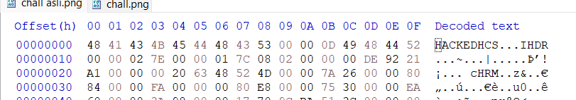
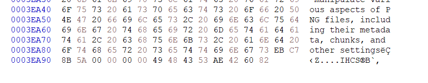
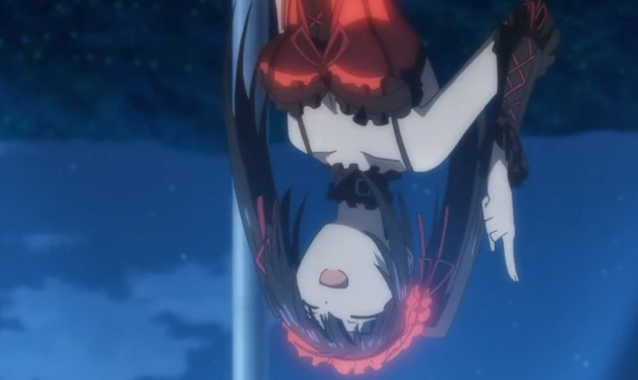
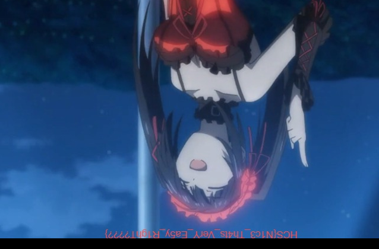

# Lend me your signature

Author: abdierryy

Category: Forensic

Flag: `HCS{N1c3_Th4ts_VerY_Ea5y_R1ghT????}`

## Description
Aku sedang dikirim gambar waifu oleh temanku, tapi sepertinya gambar tersebut tidak bisa dilihat. Tolong bantulah aku!

## Difficulty
Easy (hm)

## Solution
Langkah pertama setelah melihat cara untuk memperbaiki chall.png yaitu - mengecek hex signature

Berikut adalah screenshot dari bagian header image:

Di bagian header terlihat "HACKEDHCS" yang seharusnya merupakan tempat untuk header dari file .png (89 50 4E 47 0D 0A 1A 0A).

Setelah merubah bagian header, gambar bisa dibuka namun ada error terkait IHCS.

Bagian footer pun saya cek, dan metadata yang seharusnya IEND diubah menjadi IHCS.

Setelah merubah header dan footer, gambar pun bisa terbuka tanpa error di TweakPNG. (Nama program didapat dari hex signature di bagian footer yang menandakan exif - user comment)

Kita pun dapat mengubah bagian IHDR, dan menambahkan height, dan flag akan terlihat.

